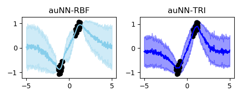

# Activation-level uncertainty in deep neural networks

Code for "Activation-level uncertainty in deep neural networks" (https://openreview.net/forum?id=UvBPbpvHRj-)

## Dependencies

This project runs with Python 3.6. Before running the code, you have to install [Tensorflow](https:www.tensorflow.org) 1.X (Tensorflow 1.11 used in this project). 

## Experiments


The synthetic experiment can be reproduced by running the run.py file: ```python run.py``` 

## Citation

To cite this work, please use

```
@inproceedings{
morales-alvarez2021activationlevel,
title={Activation-level uncertainty in deep neural networks},
author={Pablo Morales-Alvarez and Daniel Hern{\'a}ndez-Lobato and Rafael Molina and Jos{\'e} Miguel Hern{\'a}ndez-Lobato},
booktitle={International Conference on Learning Representations},
year={2021},
url={https://openreview.net/forum?id=UvBPbpvHRj-}
}
```
